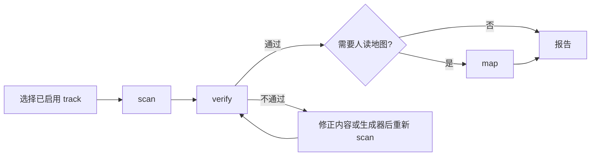

# Index Librarian Workflow

## 步骤链



## 路由规则

| 用户意图 | 命令 | 后续动作 |
|:---|:---|:---|
| 检查全部索引 / 索引状态 | `track_scan.py --all` | `track_verify.py --all` |
| 扫描一个 track | `track_scan.py --track-id <id>` | 按需运行同一 track 的 verify |
| 验证一个 track | `track_verify.py --track-id <id>` | 不通过时先重新 scan，再定位根因 |
| 生成地图 | `track_map.py --track-id <id>` | 先确认该 track 已 scan + verify |

所有命令的路径基准如下：

```bash
PROTOCOL=".agents/skills/index-librarian/protocol"
```

`--all` 只处理 registry 中 `enabled` 未设置或为 `true` 的有效 track。`enabled: false` 的 track 不参与批量运行，也不能作为单 track 目标解析。

## 报告

每个 track 以一行状态报告：

```text
{track-id}: {status} ({summary})
```

状态必须使用 `ok`、`partial`、`skipped`、`env_failed` 或 `failed`。不要以目录列表替代 scan / verify 输出。
