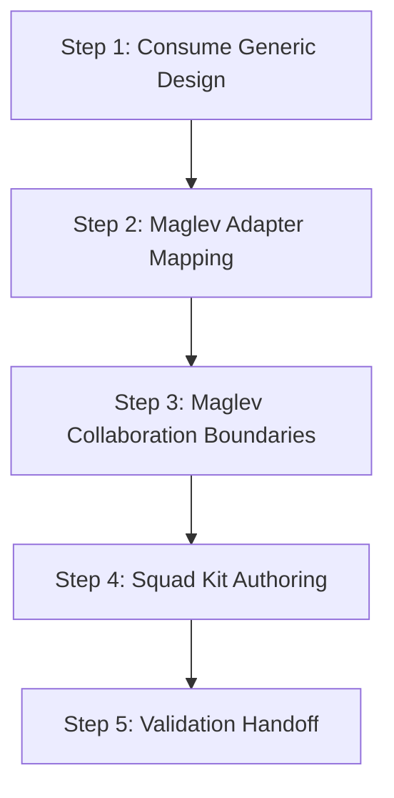

# Multica Squad Architect Workflow

## 目标

把通用 `multica-squad-design-method` 的设计包落到 Maglev Squad Kit，使其可发现、可校验、可同步、可追踪质量等级。

## 步骤

1. `step-01-squad-intent.md`：消费通用设计包，确认目标质量等级。
2. `step-02-role-topology.md`：把通用角色拓扑映射到 Maglev Squad Kit manifest 与 Agent JSON。
3. `step-03-collaboration-contract.md`：补齐 Maglev 专属双路径、写入门禁和 Bridge 边界。
4. `step-04-template-authoring.md`：落到模板文件、catalog、说明、配置指南、active spec 和测试。
5. `step-05-validation-handoff.md`：执行 Maglev 校验，输出 `squad_quality` 与远端同步判断。

## 退出条件

- 已形成 Maglev Squad Kit 模板修改与验证包；或
- 明确发现通用设计未达到 L1，应先返回 `multica-squad-design-method` 补齐协同契约。
