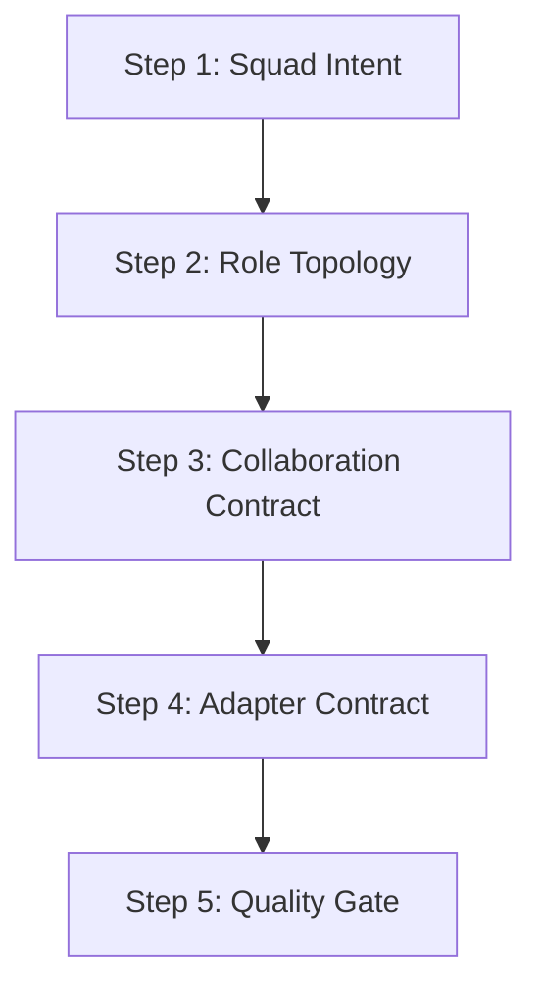

# Multica Squad Design Method Workflow

## 目标

把任意小队需求从“想几个 Agent”推进为可协同、可适配、可验证、可声明质量等级的 Multica 小队设计。

## 步骤

1. `step-01-squad-intent.md`：固定目标、受众、边界、输入与成功信号。
2. `step-02-role-topology.md`：设计 Coordinator、成员角色、权限、并发和终止条件。
3. `step-03-collaboration-contract.md`：定义 Multica 原生接力、Handoff、横向委派边界和失败排查。
4. `step-04-adapter-contract.md`：声明目标平台如何承接模板、权限、写入和验证。
5. `step-05-quality-gate.md`：根据证据输出质量等级和允许声明。

## 退出条件

- 已形成可交给 Adapter 落地的小队设计包；或
- 发现目标只需要单 Agent、普通流程或已有小队扩展，不应独立成小队。
