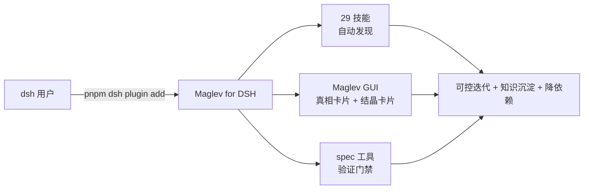

# Maglev for DSH

> Maglev 面向 DeepSeek Harness（dsh）的独立插件制品：让软件研发团队和个人，在 dsh 里做**长期可控的项目迭代**，迭代中**天然沉淀知识资产**，从而**降低项目对特定的人和 AI 体系的依赖**。

## 它是什么

一个**自包含的 dsh 插件**。装上它，dsh 就拥有：

1. **29 个 Maglev 技能**：收敛 → 设计 → 验证 → 结晶主链路 + 治理纪律 + 知识沉淀。技能随插件**自动注入**（`maglev-bundled` provider），任意项目（无需本地 `.agents/skills`）都能发现并使用
2. **Maglev GUI**：
   - **结晶卡片**：每次迭代沉淀了什么，以卡片形式弹在会话流里
   - **真相卡片**：AI 读到的项目现状（能力域/主题/契约状态），对人可见
3. **spec 工具与验证门禁**：spec 完整性检查 + 结晶前机械门禁，把"验证"从模型自觉变成机械约束



## 它解决什么问题

dsh 提供了强大的执行能力（agent 循环、工具、沙箱、多代理编排），但缺少软件研发的**流程语义**——需求 → 设计 → 验证的阶段门、验收证据、不可变 Spec、流程纪律都不存在。Maglev for DSH 补上这一层：

- **可控迭代**：结晶必须过 spec 完整性门禁，不通过就不能沉淀（机械强制，不靠 AI 自觉）
- **知识沉淀**：每次迭代结晶写回 `specs/` 知识分层，并产生会话事件（结晶卡片）
- **随时接手**：真相卡片让新接手的人快速看懂"项目是什么、做到哪了"

## 安装

> 前提：dsh 是 developer preview，**没有全局 `dsh` 命令**。所有 dsh 操作都在 **dsh 源码 checkout 目录下**用 `pnpm dsh <子命令>` 执行。

```bash
# 在 dsh checkout 目录下，把插件装进 web profile（profile 不存在会自动创建）
pnpm dsh plugin --profile web add @idea-maglev/maglev-for-dsh

# 启动 web（用默认 web profile，加载 maglev）
pnpm dsh web
```

启动后打开页面（默认 http://127.0.0.1:3080），即出现 Maglev 卡片（真相卡片 + 结晶卡片）。

> 本地开发（从源码安装，改动即生效）：`pnpm dsh plugin --profile <name> add ./maglev-for-dsh`（link 本地 checkout）。

## 使用

在会话里让 AI 调用工具即可：

- `maglev_reality_status`：读项目现状（能力域/进行中主题/愿景/契约），产生真相卡片
- `maglev_crystallize`：把已验证结论结晶到 `specs/`，产生结晶卡片（先过门禁）
- `maglev_spec_check`：spec 完整性机械检查

完整流程（安装 → 初始化/接入 → 日常迭代 → 对仓库的影响 → 场景举例）见 [使用手册](docs/usage.md)。

## 它与 Maglev、dsh 的关系

- **Maglev（源仓库）**：方法论与技能的原型，仅作参考，**非运行时依赖**（本插件零依赖，见下）
- **dsh**：执行层宿主（agent harness），插件运行其上
- **本仓库**：从 Maglev **一次性派生**的自包含插件制品，与 Maglev 源**零运行时依赖**，技能资产独立演进

> 技术注记：本插件 host 侧**不直接依赖 `@deepseek-ai/dsh-tools`**（工具定义手动构造），避免 dsh-tools 多实例导致的工具调度器符号分裂（详见 `docs/thinking/2026-08-15-dsh-tools-instance-split.md`）。技能通过 `ctx.skills.registerProvider` 注入（dsh 的 bundled skill 机制，rank 600 低于项目技能，项目优先），因此任意环境安装即用。

## 自证原则（dogfooding）

本仓库**本身**就是通过 Maglev 机制构建和治理的：它的演进走 Maglev 主链路，知识沉淀在 `specs/` 三层（`00_vision` / `10_reality` / `20_evolution` / `90_archive`），决策记录在 `docs/thinking/`。

> **Maglev 用自己构建自己，用自己治理自己。** 只有本仓库自己跑通了"迭代 → 结晶 → 知识沉淀"闭环，才有资格论证插件真实有效。

## 仓库结构

| 路径 | 用途 |
|---|---|
| `index.ts` | dsh host 插件入口（3 个 spec 工具 + 结晶门禁 + 会话事件） |
| `src/client/` | dsh client 插件（真相卡片 + 结晶卡片） |
| `.agents/skills/` | 29 个固化技能（产品资产）+ `_internal` 协议主体 |
| `specs/` | 本仓库自己的知识分层（dogfooding 自证） |
| `docs/thinking/` | 设计决策 |
| `scripts/` | maglev-python 运行时、verify_skills 验证工具 |
| `assets/` | dsh workflow 预设 |

## 验证

固化技能与 dsh 的兼容性、host/client 插件端到端链路均已实证（见 `docs/validation.md` 与 `specs/10_reality/README.md`）：

```bash
python3 scripts/verify_skills.py          # 校验 29 技能符合 dsh 发现协议
python3 scripts/spec_integrity_check.py   # spec 完整性检查
```

## 许可证

MIT（见 [LICENSE](LICENSE)）。
