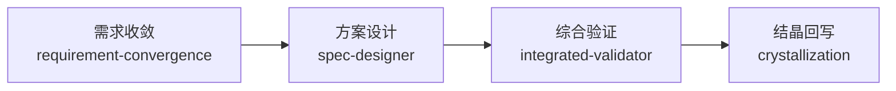

# Maglev 主链路 workflow 资产

本目录是 Maglev 主链路在 dsh 上的 workflow 参考资产，包含两部分：

| 文件 | 作用 |
|---|---|
| `maglev-mainline.meta.json` | workflow 的 `meta`（name/description/whenToUse/phases），作为 dsh workflow 工具的 `meta` 参数 |
| `maglev-mainline.script.js` | workflow 的 `script`（编排体），作为 dsh workflow 工具的 `script` 参数 |

## 用法

dsh 的 workflow 由模型在会话中通过 `workflow` 工具执行。本资产是**参考实现**，用于：

1. 让模型参考这个骨架，生成贴合当前上下文的 workflow
2. 用户/模型可直接把 `meta.json` 的内容作为 `meta` 参数、`script.js` 的内容作为 `script` 参数调用

## 编排逻辑

每个阶段启动一个 subagent，要求先用 `skill` 工具加载对应的 Maglev 技能，再把上一阶段产出通过 prompt 传给下一阶段，形成可追溯的链条。

## 设计说明

- **为什么不用 workflow 硬编码流程语义**：dsh 的 workflow 是"模型临场写的编排脚本"，而 Maglev 的流程语义主体在**技能本身**（`.agents/skills/`）。workflow 脚本只是"把技能串起来"的骨架，真正的收敛/设计/验证/结晶逻辑在技能里。这保持了单一事实源：技能是流程语义的唯一权威，workflow 是编排粘合。
- **阶段间传参**：每个阶段把产出文本传给下一阶段，保证链条可追溯；最终 `return` 返回完整链条，供上层消费。
