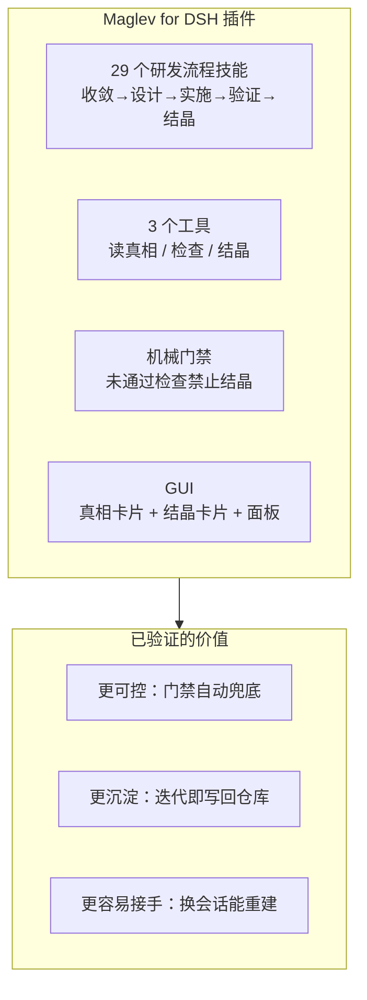
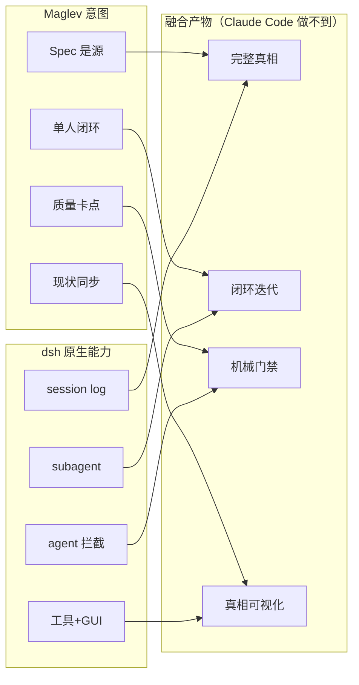

# Maglev for DSH — 成果总结

> 更新时间：2026-08-15
> 读者：团队、决策者、未来接手者

## 一句话

**我们把 Maglev 做成了 DeepSeek Harness（dsh）的插件，并验证了它对"个人开发者做可控迭代、沉淀知识、降低依赖"的真实价值。**

## 背景：要解决什么问题

AI 写代码变快，但三个问题没有消失：

1. **迭代不可控**：需求、设计、代码、验证持续漂移，返工没减少
2. **知识不沉淀**：每次迭代的决策散在聊天里，换人、换工具就丢
3. **强依赖**：项目进展绑在某个人的记忆、某个 AI 平台的会话历史上

Maglev 的思路是：**把知识资产沉淀到项目仓库本身，用受控流程让 AI 围绕仓库工作。**

## 核心成果

- **29 个技能**：装上插件，dsh 自动拥有完整的研发流程技能
- **3 个工具**：读项目真相（现状结构）、检查完整性、结晶（把结论写回知识层）
- **机械门禁**：结晶前强制检查，不通过就拦截（不靠 AI 自觉）
- **GUI**：结晶卡片（每次沉淀了什么）+ 真相卡片（项目现状）+ 面板（知识分层 + 迭代进度）

## 关键验证：不是"能跑"，是"有价值"

我们用**真实迭代**验证了价值（而非只看机制能跑）：

| 价值 | 验证方式 | 结果 |
|---|---|---|
| 更可控 | 一个人走完整迭代，观察门禁是否兜底 | ✅ 结晶前自动检查，前后对照验证 |
| 更沉淀 | 迭代完成后看仓库多了什么 | ✅ 自动沉淀结晶 + 决策记录 + 索引同步 |
| 更容易接手 | 换一个全新会话，只读仓库 | ✅ 准确重建"刚改了什么、为什么、有什么边界" |

其中一次真实迭代里，AI 甚至**主动披露了自己的局限**（"会话内工具是旧实例，不能冒充新代码验证"）——这是纪律在真实工作中自然生效，不是演示摆拍。

## 底层架构：意图 × dsh 能力

我们不移植 Maglev 的"技能形态"，而是融合 **Maglev 的设计意图 × dsh 的原生能力**，产出四个融合点：

这四个融合点全部被真实会话验证成立。**尤其"完整真相（Spec 仓库 + 过程日志）"和"闭环迭代"，是 Maglev 在 Claude Code 宿主上根本做不到的**——这是产品化的真实新空间。

## 当前状态

| 项 | 状态 |
|---|---|
| 插件制品（技能 + 工具 + GUI） | ✅ 已完成，端到端验证 |
| 单人闭环价值 | ✅ 已验证（真实迭代） |
| 浏览器演示（录屏级） | ⏳ 待做（GUI 已能加载，缺人眼演示） |
| 发布渠道（npm / 私域） | ⏳ 待定 |
| 迭代看板动态化 | ⏳ 待做 |
| 3 人碰撞（团队协作） | 后续扩展 |

## 下一步（按优先级）

1. **浏览器演示**：录一段"结晶 → 卡片弹出"的完整演示，作为对外传播素材
2. **定发布渠道**：npm 公开 或 公司私域 registry，补构建发布流程
3. **迭代看板动态化**：面板的迭代进度接真实数据

## 一句话给接手者

核心问题"Maglev 能不能做成 dsh 插件、有没有真实价值"的答案——**能，且已被真实迭代证实**。要发布，只需：浏览器演示 → 定发布渠道 → 看板动态化。
