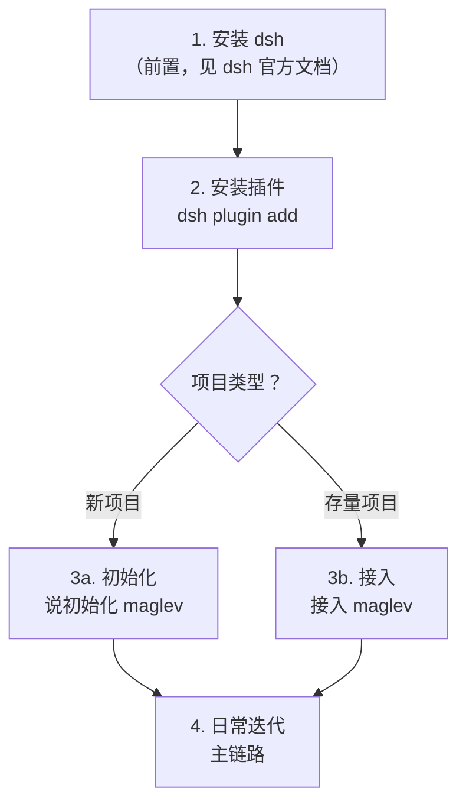
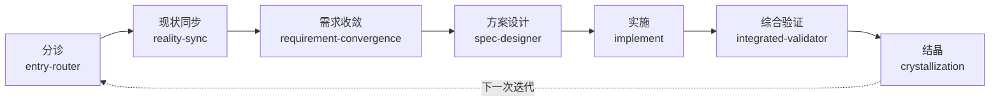

# Maglev for DSH — 使用手册

> 面向第一次使用的人。回答：怎么装、怎么用起来、插件会动你仓库的什么、以及每个能力解决什么问题。

## 一、完整操作流程

> **触发方式**：所有能力用**自然语言**触发——dsh 会把 29 个技能的名称和描述注入模型，agent 自己识别"初始化 maglev"该用哪个技能。当前插件**不注册斜杠命令**（`/standup` 这类只在技能文档里作为"兼容入口"描述，不是真实命令）。



### 1. 前置：安装 dsh

dsh（DeepSeek Harness）是本插件的宿主。它的安装方式以 dsh 官方文档为准（当前是 developer preview）。装好后能执行 `dsh --profile web` 启动即可。

### 2. 安装 Maglev for DSH

```bash
# ① 在 ~/.npmrc 加一行（让 @idea-maglev scope 走公域 npm，其他包不受影响）
@idea-maglev:registry=https://registry.npmjs.org/

# ② 安装到 profile
dsh plugin --profile web add @idea-maglev/maglev-for-dsh
```

装完即拥有：29 个技能（自动注入）、3 个 spec 工具 + 结晶门禁、真相卡片 + 结晶卡片。

### 3a. 新项目初始化（Greenfield）

在项目目录启动 dsh，对 AI 说：

```
初始化 maglev
```

AI 会调用 `maglev-bootstrapper`，做三件事：分析环境 → 注入骨架 → 交互式登记仓库信息（代码路径、仓库类型等）。

### 3b. 存量项目接入（Brownfield）

对已有代码、但还没有 Maglev 结构的项目：

```
接入 maglev，先帮我理解这个项目的现状
```

AI 会调用 `maglev-legacy-adopter`：环境诊断 → 基础设施注入 → 调用 `maglev-reverse-spec` 逆向重建第一个"现实锚点"（项目是什么、有哪些功能/数据结构/边界）。

### 4. 日常迭代（主链路）

初始化/接入之后，日常就是一个闭环：



## 二、插件对目标仓库的影响

**关键认知：装插件本身不碰你的仓库。** 影响分四档：

| 动作 | 对仓库的影响 |
|---|---|
| **安装插件**（`dsh plugin add`） | **零改动**——插件装在 dsh profile，技能运行时注入，不动项目目录 |
| **读真相**（`maglev_reality_status` / `maglev_spec_check`） | 只读，不写 |
| **结晶**（`maglev_crystallize`） | 写入 `specs/<目标层>/` 一个结晶文件（如 `2026-08-16-xxx.md`） |
| **初始化**（对 AI 说"初始化 maglev"） | 注入 Maglev 核心结构：`specs/`（知识分层）、`docs/thinking/`、`issues/`、`AGENTS.md`（会话纪律）、`.maglev/` 配置、以及 `.agents/` 下的 Reality Profile（`00_profile.yaml`）。**注意：不会把插件的 29 个技能复制进项目**——技能在插件包里，运行时注入 |

初始化后，你的仓库多了这些目录，它们的作用：

| 路径 | 是什么 |
|---|---|
| `specs/00_vision/` | 项目愿景（一句话要达成什么） |
| `specs/10_reality/` | 当前已成立的事实（可证实的能力、实现、边界） |
| `specs/20_evolution/active/` | 正在推进的演进主题 |
| `specs/90_archive/` | 已归档的历史依据 |
| `docs/thinking/` | 设计决策（"为什么这么做"） |
| `AGENTS.md` | 会话纪律（三条红线，AI 每次会话读取） |

## 三、能力与场景（痛点 → 解法）

### 主链路（日常迭代的核心）

| 能力 | 解决什么痛点 | 怎么用 | 例子 |
|---|---|---|---|
| **entry-router 分诊** | 模糊任务被直接拖进编码，方向错了浪费一整天 | 任务开始先分诊 | "帮我看看这个需求属于哪类，该怎么走" |
| **reality-sync 现状同步** | 隔几天回来忘了"做到哪、卡在哪、下一步" | 会话开始说"同步现状" | "同步一下项目现状" |
| **requirement-convergence 需求收敛** | AI 理解偏了需求就开干，做完才发现不对 | 动手前锁边界和成功信号 | "先把范围、不做什么、成功标准定清楚再动手" |
| **spec-designer 方案设计** | 没有方案直接写代码，返工 | 需求稳定后先出方案 | "先出方案，别急着写代码" |
| **context-implementer 实施** | 文档/配置改动后不做自检和对抗审查 | 实施后自检 + 对抗审查 | "改完文档后自查一遍，再做对抗性审查" |
| **integrated-validator 综合验证** | AI 自评"都对齐了"，实则需求↔代码脱节 | 收口时交叉验证 | "验证需求、设计、代码、测试是否一致" |
| **crystallization 结晶** | 做完就丢，结论不沉淀，下次重来 | 验证后把结论写回真相层 | "把这次结论结晶到 10_reality" |

### 机械门禁（不靠 AI 自觉）

- **结晶前 spec 完整性门禁**：AI 调 `maglev_crystallize` 时，若项目的 spec 骨架 / 纪律区块 / 主链路技能 / 决策记录不全，会**被机械拒绝**（返回"spec 完整性检查未通过"）。这是硬拦截，不是 AI 自我提醒。
- 例子：在一个没初始化的项目里让 AI 结晶 → 被拒 → 提示先修复真相层。

### 存量项目能力

| 能力 | 解决什么痛点 | 例子 |
|---|---|---|
| **maglev-reverse-spec 逆向** | 老项目没文档，看不懂结构、改不动 | "逆向这个项目，重建规格" |
| **maglev-legacy-adopter 接入** | 存量项目没有 Maglev 结构，无从下手 | "接入 maglev，先建最小环境" |

### 治理纪律（全程背景）

`maglev-discipline` 三条不可灰度红线：**闭环验证**（证据说话）、**事实驱动**（先查证再下结论）、**穷尽方法**（宣告无解前走完方法）。它作为会话级背景纪律，约束 AI 不偷懒、不幻觉、不跳步骤。

### GUI（会话内可见）

| 界面 | 什么时候出现 | 给你什么 |
|---|---|---|
| 📋 **真相卡片** | AI 调 `maglev_reality_status` | 项目现状结构（能力域/主题/契约状态），对人可见 |
| 🔮 **结晶卡片** | AI 调 `maglev_crystallize` | 这次沉淀了什么（标题/结论/写入路径），会话里看得见 |

## 四、一个完整的场景示例

**场景**：你有一个存量的 Node 服务，想在不了解它的情况下改一个功能。

1. **接入**：`接入 maglev，先帮我理解这个项目` → AI 逆向重建规格（功能/数据结构/边界）
2. **看真相**：`请调用 maglev_reality_status 报告现状` → 真相卡片弹出，你一眼看到项目结构
3. **收敛需求**：`我要加一个 X 功能，先把范围、不做什么、成功标准定清楚` → AI 锁边界
4. **方案**：`先出方案，别急着写代码` → AI 形成可执行方案
5. **实施** → **验证**：`验证需求、设计、代码是否一致` → 交叉验证
6. **结晶**：`把这次改动结晶到 10_reality` → 过门禁，写回真相层，结晶卡片弹出

至此，一次迭代既完成了功能，又把"做了什么、为什么"沉淀进了仓库，下次回来说"同步现状"就能接上。
