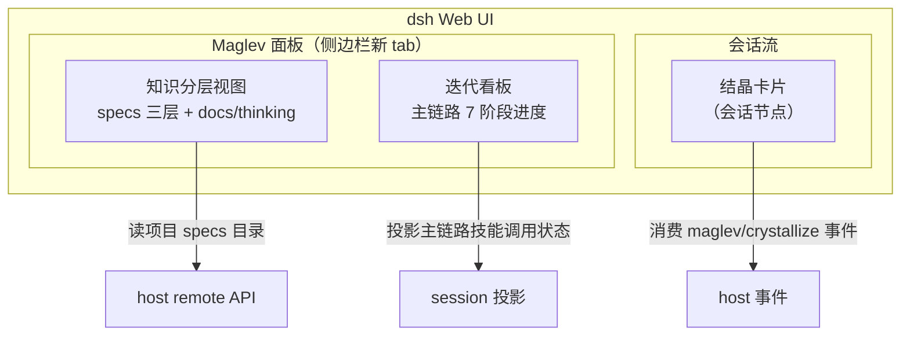
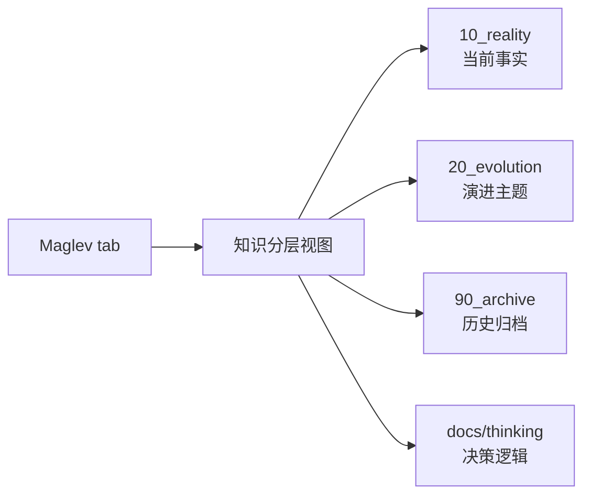
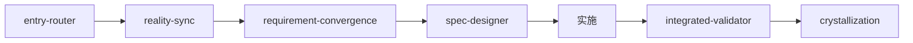
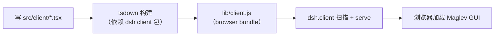

# Maglev for DSH — client 插件（GUI）详细设计

> 状态：设计稿（待评审）
> 更新：2026-08-15
> 前置：host 插件已实现（`index.ts`：`maglev_spec_check` + `maglev_crystallize` + `maglev/crystallize` 事件）

## 1. 设计目标（一句话）

把 Maglev 三件"抽象的事"变成 dsh 里"看得见"的界面：**① 项目知识分层是什么状态；② 当前迭代走到主链路哪一步；③ 每次结晶沉淀了什么**。

## 2. GUI 信息架构



三个界面载体，对应三个数据源（后面第 3 节详述）。

## 3. 三个界面的具体设计

### 3.1 结晶卡片（会话节点）

**触发**：host 的 `maglev_crystallize` 工具被调用 → 产生 `maglev/crystallize` 会话事件。

**卡片内容**（渲染在会话流中，一次结晶一张卡）：

| 字段 | 来源 |
|---|---|
| 标题 | 事件的 `title` |
| 一句话结论 | 事件的 `summary` |
| 写入路径 | 事件的 `written`（如 `specs/10_reality/2026-08-15-xxx.md`） |
| 目标层 | 事件的 `target`（10_reality / 20_evolution / 90_archive） |

**视觉参考**：类似 dsh 的 review 卡片（`adding-a-conversation-node.md` 的 `review-job` 示例），一个标题 + 摘要 + 可点击的写入路径。

**技术路径**：`ConversationNodeDefinition`（`match` 匹配 `maglev/crystallize` 事件 → `start/update` 构建状态 → `buildViewNode` 渲染卡片 + `SlotMap` merge + React 组件）。

### 3.2 Maglev 面板 — 知识分层视图

**位置**：侧边栏（`ui-sidebar`）新增一个 "Maglev" tab。

**内容**：项目的 specs 三层知识，树状展示：



每个节点显示该层的**文件清单**（如 10_reality 下的 README.md、派生记录等）。用户点开可见文件摘要。

**数据源**：host 提供 `maglev.list_knowledge` remote API（读项目 specs 目录结构），client 面板打开时调用。

### 3.3 Maglev 面板 — 迭代看板

**内容**：主链路 7 阶段的进度条：



**数据源**：会话投影（`session projection`）——host 在技能被调用时记录阶段事件，client 投影成进度。当前迭代走到哪一步，看板就亮到哪一步。

> 注：迭代看板的"阶段事件"需要 host 补充（技能调用时记录阶段），这是 G4 的工作；第一版先做静态看板（展示 7 阶段结构），G4 接动态数据。

## 4. 制品结构（client 插件源码，全部在 maglev-for-dsh 内）

```
maglev-for-dsh/
├── package.json              # 已含 dsh.bundle；需新增 dsh.client 声明
├── index.ts                  # host 插件（已实现）
├── src/
│   └── client/
│       ├── index.ts          # client 入口：apply(ctx) 注册 Definition + slot
│       ├── crystallize-node.ts   # 结晶卡片的 ConversationNodeDefinition
│       ├── CrystallizeCard.tsx    # 结晶卡片 React 组件
│       ├── MaglevPanel.tsx        # Maglev 面板容器（tab）
│       ├── KnowledgeView.tsx      # 知识分层视图
│       ├── IterationBoard.tsx     # 迭代看板
│       └── slots.ts              # slot 类型声明
├── tsdown.client.ts          # client bundle 构建配置
└── lib/
    └── client.js             # 构建产物（browser bundle，分发用）
```

## 5. 构建与加载（不侵入 dsh 仓库）



- **构建**：`tsdown.client.ts`（复用 dsh 的 `clientBundle` preset 思路），产出 `lib/client.js`
- **依赖**：构建时依赖 dsh client 包（`@deepseek-ai/dsh-client-runtime` 等），开发阶段把 dsh checkout 的包**链接到 maglev-for-dsh/node_modules/**（改 maglev 自己，`.gitignore` 已排除，不碰 dsh 仓库）
- **加载**：`dsh plugin add maglev-for-dsh` 或 `--patch`，dsh Node half 扫描 `dsh.client` 声明，serve `lib/client.js`

## 6. 分阶段实现

| 阶段 | 交付 | 验证信号 |
|---|---|---|
| **G1 骨架** | `dsh.client` 声明 + `tsdown.client.ts` + 空 client 入口（能构建出 bundle） | `lib/client.js` 产出 + dsh 扫描到 client 插件 |
| **G2 结晶卡片** | `crystallize-node.ts` + `CrystallizeCard.tsx`（匹配 maglev/crystallize 事件） | 调 crystallize 工具后，会话流出现结晶卡片 |
| **G3 知识分层视图** | host 补 `maglev.list_knowledge` remote API + `KnowledgeView.tsx` | 面板打开显示 specs 三层文件清单 |
| **G4 迭代看板** | host 补阶段事件 + `IterationBoard.tsx` 接投影 | 走一遍主链路，看板进度随之变化 |

## 7. 待你评审的关键决策点

1. **面板位置**：侧边栏新 tab（我的建议）还是会话区独立面板？这决定 slot 挂载位置。
2. **知识分层视图的深度**：只展示目录/文件清单（简单），还是点开能看文件内容摘要（需 host 读文件 + 摘要）？
3. **第一版范围**：先做 G1+G2（结晶卡片，最小闭环），还是直接做到 G3（面板）？
4. **依赖处理**：开发阶段"链接 dsh checkout 包到 maglev-for-dsh/node_modules"这个做法你认可吗（不碰 dsh 仓库）？

---

*这是设计稿，等你评审确认后我再按阶段实现。*
