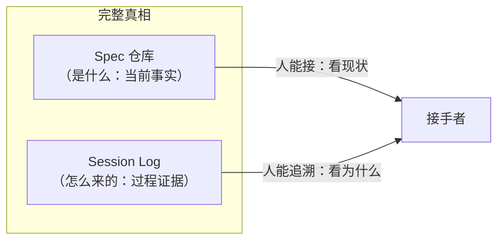
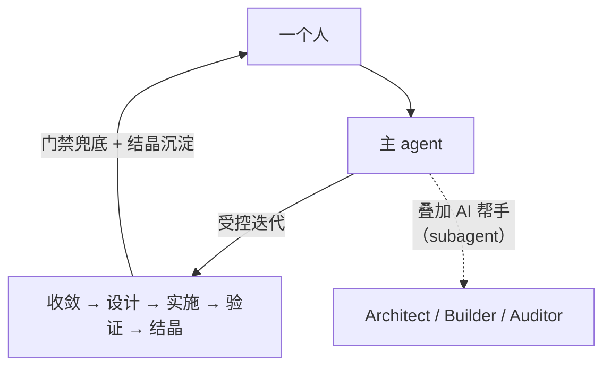
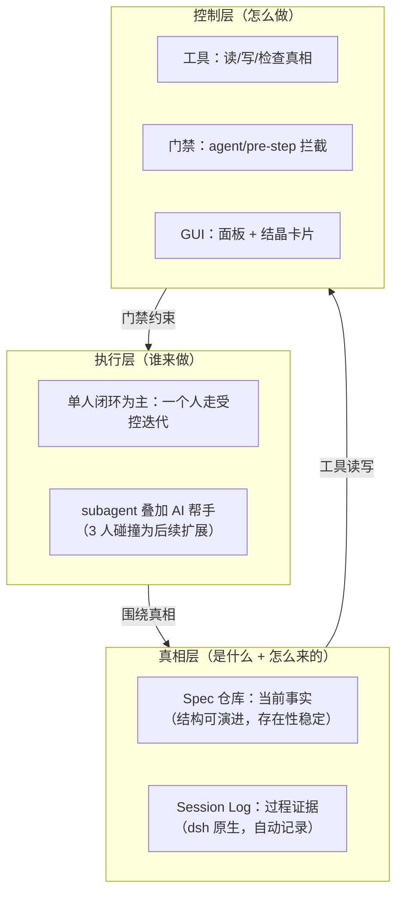

# Maglev for DSH 架构 — 意图 × dsh 能力

> 状态：架构设计 v2（意图融合，替换 v1 的"照搬技能"版本）
> 创建：2026-08-15
> 定位：从 maglev 设计意图 × dsh 原生能力的融合出发，而非移植 maglev 技能形态

## 0. 核心命题

**在 dsh 上，让「Spec 仓库 + 过程日志」成为软件研发的完整真相，让「人」围绕这个真相做受控迭代（单人闭环为主，3 人碰撞为后续）。**

这一命题同时回答三个目标：

| 目标 | 架构含义 |
|---|---|
| 长期可控迭代 | 受控链路（收敛→设计→实施→验证→结晶）由工具 + 门禁机械承载 |
| 天然知识资产 | 真相 = Spec 仓库（沉淀）+ 过程日志（自动记录），迭代即沉淀 |
| 降低依赖 | 真相是仓库文件 + 会话日志，跨人、跨 AI、跨工具稳定 |

## 1. 设计意图（maglev 的本质，跨宿主不变）

从 maglev 哲学与架构中提炼的**意图**，而非技能形态：

1. **Spec 是源**：真相源是 Spec（markdown 仓库），Code 是产物；文档维护成本趋近于零
2. **单人闭环可快速正反馈**：maglev 方程的 p→1 摩擦最小，是当前务实入口——但这是"先单人拿到正反馈"，不是"鼓吹超级个体"；3 人碰撞产出更好产品，是后续目标形态
3. **Overlay 而非 Relay**：同一人/同一 AI 在不同时间叠加不同能力，而非角色接力（这是 subagent 的用法，不是团队形态）
4. **降噪 / 证据驱动**：异构输入 → 事实（Interface + Schema，去 IF/ELSE）；Fact/Inference/Unknown 分层
5. **质量卡点**：floor（接手者能解释用法）/ ceiling（不写过程流水），可执行验证 fail=0

## 2. dsh 原生能力（执行层的强项）

| dsh 能力 | 本质 |
|---|---|
| session log | 事件溯源（"model-visible means logged"），完整过程可回放、可审计 |
| subagent | 真正多代理：spawn/fork/多 provider，并行子代理接力 |
| workflow | 脚本编排多代理（pipeline/parallel/phase） |
| goal | 同会话长期目标，跨轮续跑 |
| skill 发现 | 原生扫描 .agents/skills |
| tools + agent/pre-step | 工具注册 + 拦截门禁 |
| GUI（client 插件 + slot） | 可视化：面板、会话节点 |

## 3. 四个融合点（独特价值 = 意图 × 能力）

这是 maglev 在 Claude Code 宿主上**做不到**、而在 dsh 上**原生成立**的产品新空间：

### 融合点 1：完整真相 = Spec 仓库 + 过程日志

maglev 只有 Spec 仓库（"是什么"），dsh 的 session log 补上"怎么来的"。**人能接手 = 看 Spec 现状 + 看过程日志溯源**，这是"降低依赖"的完整形态。

### 融合点 2：单人闭环（当前主线）+ 3 人碰撞（后续扩展）

**当前主线 = 单人闭环**：一个人用 dsh 自己走完受控迭代，快速拿到正反馈（门禁兜底、知识自动沉淀、随时可接手）。subagent 是"一个人叠加 AI 帮手"的工具，不是"多人接力"的载体。

**后续扩展 = 3 人碰撞**：单人闭环拿到正反馈后，再走向 3 人互相碰撞（更好的产品形态，但当前条件苛刻——要凑齐人、协作成本高、正反馈慢）。

### 融合点 3：质量门 = 工具检查 + 机械门禁

maglev 的质量卡点是"AI 自觉跑脚本"；dsh 让 `agent/pre-step` 拦截变成**机械强制**——不收敛需求就不能实施、不通过检查就不能收口。

### 融合点 4：真相可视化 = 工具读真相 + GUI

maglev 的现状同步是"AI 读仓库出五段文字"；dsh 让它变成**工具读真相 + 面板可视化**——面板展示真相结构、结晶卡片展示沉淀。

## 4. 三层结构（意图稳定，实现可演进）

## 5. 稳定性来源（关键：意图稳定，非结构固定）

之前 v1 架构把"稳定性"压在"specs 目录结构固定"上，这是错的（maglev 自己结构一直在变）。正确的稳定性是：

| 层 | 稳定的东西 | 可演进的东西 |
|---|---|---|
| 真相层 | **存在性**（有 Spec 仓库 + 有过程日志） | Spec 的具体结构、字段 |
| 执行层 | **受控迭代链路**（收敛→设计→实施→验证→结晶） | 单人/多人的协作形态、子代理编排 |
| 控制层 | **协议**（读/写/检查三职责、门禁语义） | 工具实现、GUI 视图 |

**护城河 = 完整真相的存在性 + 受控迭代链路 + 三职责协议。** 具体实现随 dsh/maglev 演进而演进，但意图与协议稳定。

## 6. 长期演进

| 演进方向 | 做法 | 是否动摇架构 |
|---|---|---|
| 换宿主（Claude Code/Codex） | 真相层（Spec 仓库）跨宿主；过程日志换宿主实现 | 意图不动，实现换 |
| 单人 → 3 人碰撞 | subagent 从"单人叠加 AI 帮手"扩展到"多人接力" | 执行层扩展，链路不动 |
| 加新真相 | Spec 加层 | 真相存在性不动 |
| 加新视图 | GUI 加 slot | 控制层视图扩展 |

## 7. 落地验证路径

| 阶段 | 验证什么 | 对应融合点 |
|---|---|---|
| S1 | 工具读真相 + 门禁拦截 | 融合点 3、4 |
| S2 | GUI 面板展示真相 + 结晶卡片 | 融合点 4 |
| S3 | 单人闭环：一个人叠加 subagent AI 帮手走受控迭代 | 融合点 2 |
| S4 | 过程日志可回放（接手者能从日志+Spec 重建） | 融合点 1 |

---

*本架构 v2 从"意图 × 能力"融合出发，替代 v1 的"照搬技能"。核心创新 = 四个融合点，是 maglev 在 Claude Code 宿主上做不到的产品新空间。产品顺序：单人闭环（快速正反馈）→ 3 人碰撞（更好产品）。*
